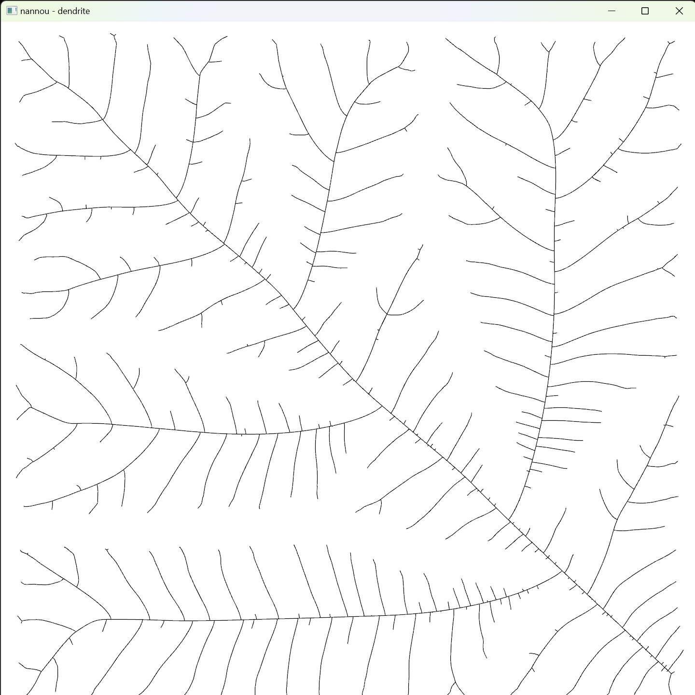

### Run

1. install rust

    > https://www.rust-lang.org/learn/get-started

2. clone this repository

3. ```bash
    cargo run --release
    ```

### Setting
edit ./src/dendrite_setting.rs

### Gallery

test mode




music by antihoney
https://antihoney.bandcamp.com/album/antihoney-demo-compilation